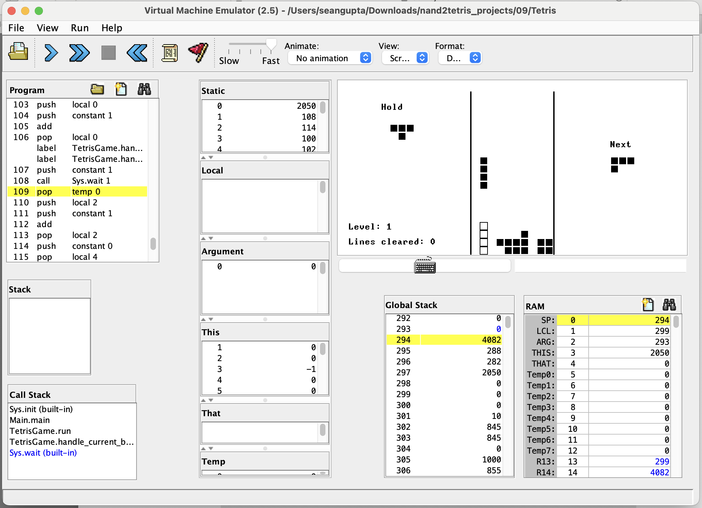

This project-based online course focuses on building a modern computer from first principles, starting from elementary logic gates and ending with a general-purpose computer.

Steps along the way:
- Elementary logic gates
- Arithmetic logic unit and RAM
- CPU, memory, Harvard architecture
- Assembly language and assembler
- VM and VM-to-assembly translation
- Compilation (to be added)
- Operating system (to be added)

Full info at https://www.nand2tetris.org.

---
 
As part of this course, a fully-functional Tetris game was built in the Jack language. This is a simple, object-based language similar to Java. It does not feature inheritance / hash maps / floats / other essentials.
 
 
The game follows the Nintendo rotation system. It does not (yet) support wall kicks or lock delays.
 
 

To run:

1. Download the Nand2Tetris software suite at https://www.nand2tetris.org/software. It contains the Jack Compiler and Virtual Machine Emulator.
2. Pull this repo.
3. Compile the game with `sh JackCompiler.sh path/to/nand2tetris/09/Tetris`
4. Load it in the Virtual Machine Emulator. Confirm to use built-in implementations of OS functions. Select no animation.
5. Hit run and enjoy!